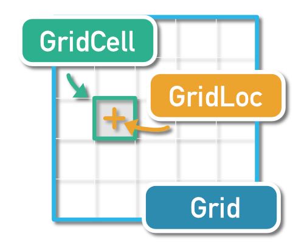

# MFGridUtils
*Grid scanning made easy*

A simple **Foundation** and **CoreGraphics** extension to execute operations on grids**

## Description

**Grids are 2 dimensions arrays with a minimal size of 1.**

Principal types are the following :

### GridLocation

A location in a grid, given column an row

### GridSize

A grid size, in columns and rows

### GridCell

A grid cell, containing location in grid and rect in frame

## Classes

### MFGridUtils

The main library file

### MFGridLocation

Defines a location in grid, with column and row

### MFSKGridNode

A grid node for SpriteKit

### MFGridScanner

Iterate through grid cells

### MFGridSize

Defines grid dimensions in columns and rows

--

*©2024 Moose Factory Software*
