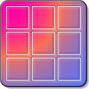

# MFFoundation
*Used for years. Recrafted with care.*

**NSFoundation** and **CoreGraphics** helpers.

MFFoundation is a collection of must have extensions for swift. 

## Classes

### CoreGraphics

CGSize+Extras.swift
CGContext+Bitmap.swift
CGFloat+Extras.swift
CGGeometry+Operators.swift
CGPoint+Extras.swift
CGRect+Extras.swift

### Foundation

Codable+JSON.swift
FileManager+Extras.swift
FileWrapper+Extras.swift
Formatters.swift
Image+Extras.swift
MFFoundation.swift
Random.swift
String+Extras.swift
SystemUtils.swift
URL+Extras.swift

--

*©2007-2024 Moose Factory Software*
